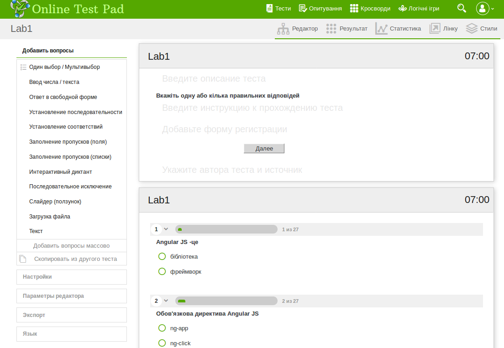
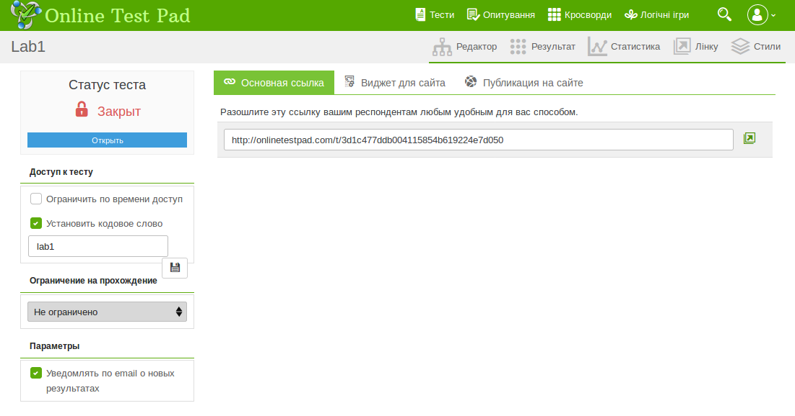
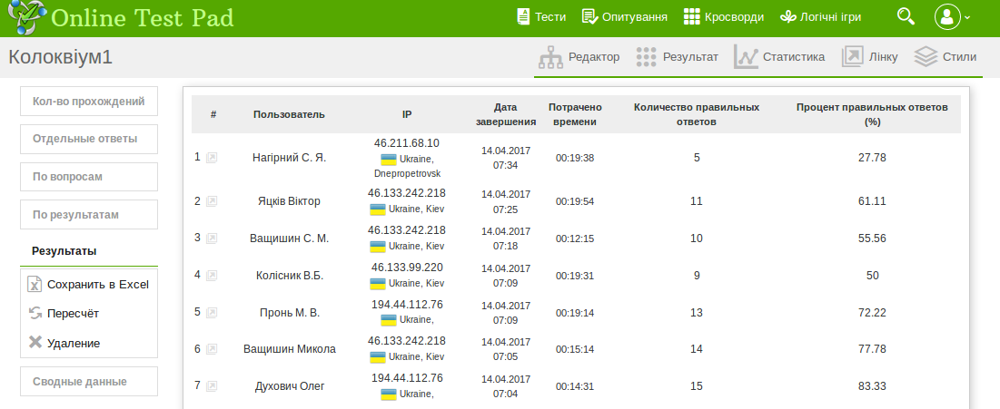
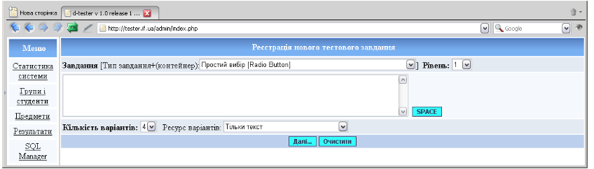
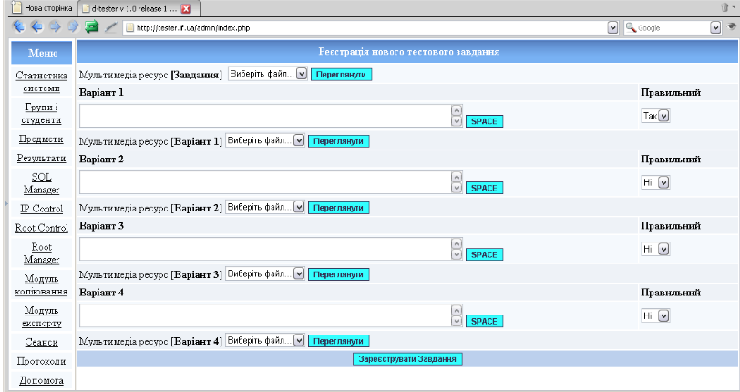
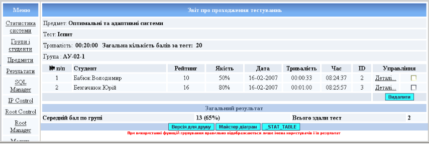
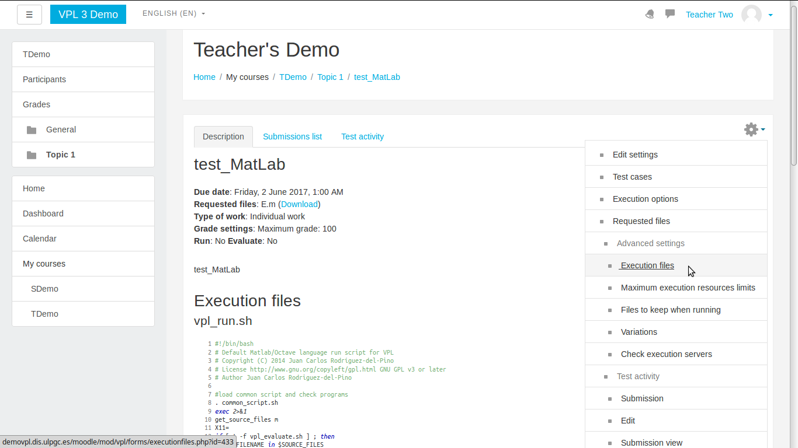
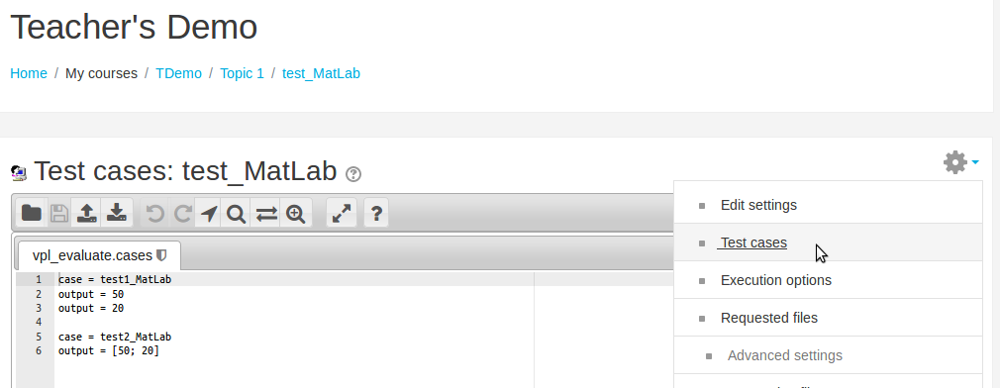
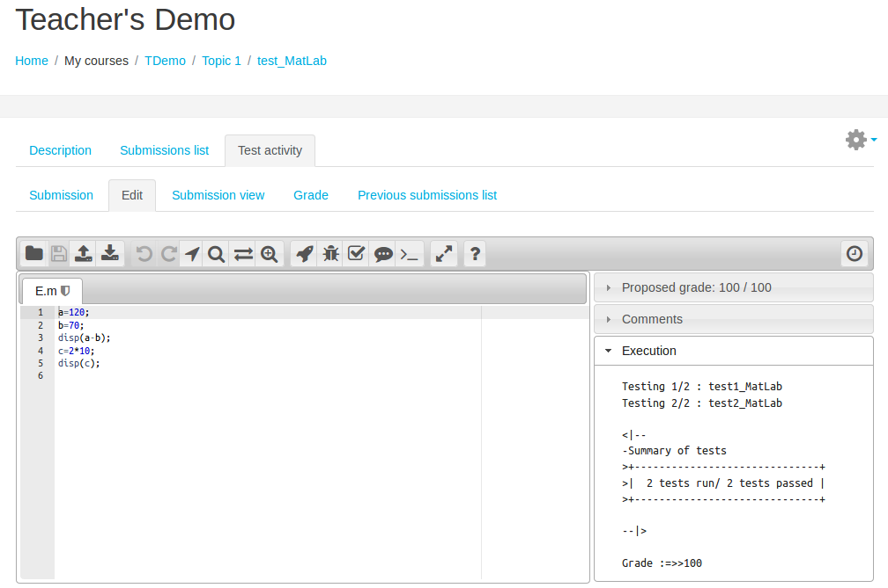
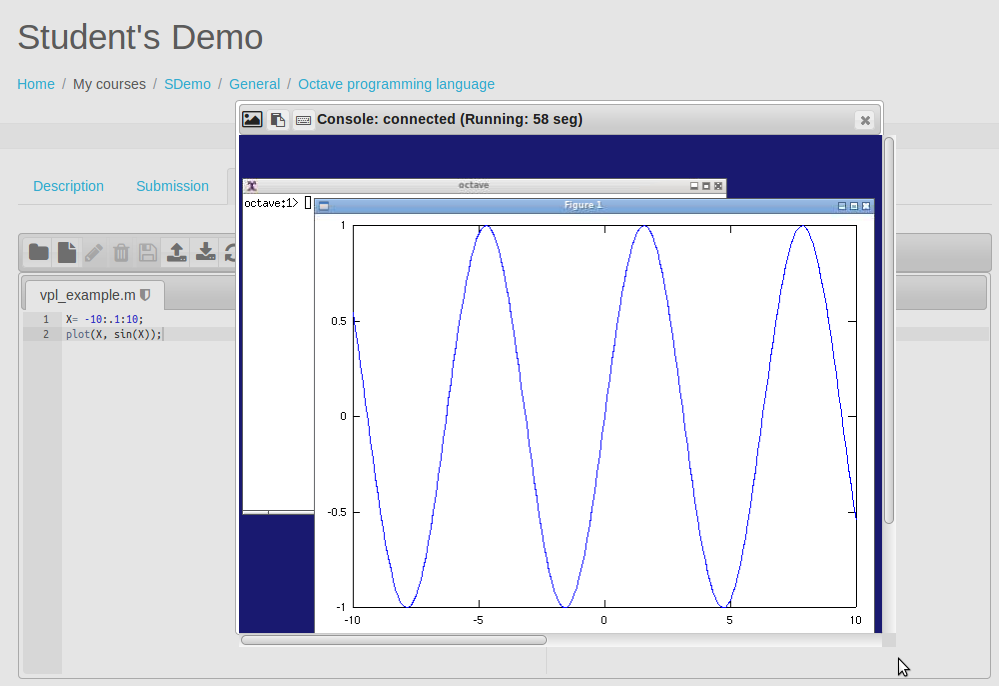

Огляд можливостей засобів проведення тестового контролю студентів
========================================================
author: Л. О. Штаєр, Ю. В. Безгачнюк
date: 25.05.2017

Анотація
========================================================

В роботі розглядається питання використання web-технологій у педагогічній діяльності на прикладі розробки тестів для проведення контролю рівня знань. Розглянуто можливості онлайн сервісів на прикладі:
- системи тестування Online Test Pad, 
- системи d-tester та 
- плагіна VPL для системи Moodle

Вступ
========================================================

- <small>Основні напрямки використання web-технологій у педагогічній діяльності: дослідження; **створення дидактичних матеріалів**; співробітництво і комунікація; публікація особистих робіт; ведення дистанційного навчання.
- Використання електронних дидактичних матеріалів дозволяє:  
 + ідивідуалізувати, диференціювати та інтенсифікувати процес навчання;

 
*** 
 
 + посилити мотивацію навчання за рахунок використання різних видів діяльності і джерел інформації;
 + формувати уміння орієнтуватися в проблемі і шукати шляхи її вирішення; 
 + змінити характер пізнавальної діяльності; 
 + діагностувати помилки і оцінки результатів; 
 + здійснювати контроль із зворотним зв'язком за наслідками діяльності; 
 + формувати інформаційну компетенцію учасників навчального процесу і т.д.</small>

Web-сервіс Online Test Pad 
========================================================

http://onlinetestpad.com/ua

====

 + <small>основне посилання - тест доступний тим, кому відправлене унікальне посилання; 
 + віджет для сторінки; 
 + публікація в загальний доступ на сторінці системи тестування</small>

===

Інструмент статистики: <small>доступно перегляд кожного результату, статистики відповідей і набраних балів по кожному питанню, статистики по кожному результату. У табличному вигляді представлені всі результати, реєстраційні параметри, відповіді на всі питання, які можна зберегти у форматі Excel.</small> 

Система діагностування рівня знань d-tester
===

<small>Підтримка створення 5 типів тестових завдань:
- простий вибір [Simple Choice], 
- мульти-вибір [Multi Choice], 
- поле вводу [Input Field], 
- поле вводу із числовим аналізатором [Numerical], 
- форма вводу [Task Form]. </small>

===

Переваги використання системи d-tester
===

- можливість збереження з метою відновлення інформації в базі даних за допомогою модуля експорту 
- функції модуля дозволяють перенести інформацію з бази даних у зовнішній файл.
- В поточній версії системи підтримуються наступні формати вихідних файлів: 
 + <small>dt-XML Format – внутрішній формат системи d-tester з використанням XML; 
 + GIFT Format – формат, який підтримується багатьма відомими системами (Moodle); 
 + Moodle XML Format – внутрішній формат системи Moode.</small>

Плагін VPL (Virtual Programming Lab) для Moodle 
===

http://vpl.dis.ulpgc.es/index.php/about/features

Можливості:
- <small>надати можливість редагування програмного коду в браузері; 
- інтерактивний запуск програм в браузері; 
- запуск тестів для перевірки програм; 
- пошук подібності між файлами; 
- налаштування обмежень на редагування і заборона копіювання і вставляння ділянок тексту коду.

Запуск скриптів реалізовано для мов програмування Ada, C, C++, C#, Fortran, Haskell, Java, Matlab/Octave, Pascal, Perl, PHP, Prolog, Python, Ruby, Scheme, SQL і VHDL</small>

===

===

===

===

Висновки
===

 Використання розглянутих засобів розробки тестів дає можливість 
- якісно організувати елементи тестового контролю студентів,
- урізноманітнити види діяльності при вивченні предмету, 
- об’єктивно оцінити рівень знань та 
- мотивувати до його вдосконалення.

